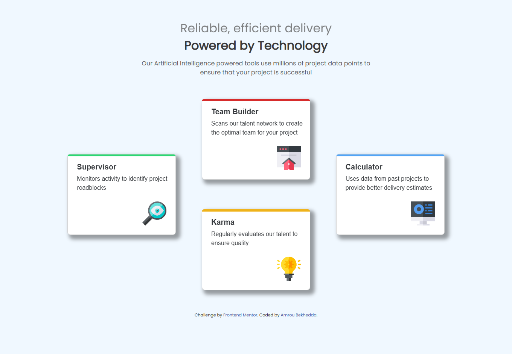

# Frontend Mentor - Four card feature section solution

This is a solution to the [Four card feature section challenge on Frontend Mentor](https://www.frontendmentor.io/challenges/four-card-feature-section-weK1eFYK). Frontend Mentor challenges help you improve your coding skills by building realistic projects. 

## Table of contents

- [Overview](#overview)
  - [The challenge](#the-challenge)
  - [Screenshot](#screenshot)
  - [Links](#links)
- [My process](#my-process)
  - [Built with](#built-with)
  - [What I learned](#what-i-learned)
  - [Useful resources](#useful-resources)
- [Author](#author)
- [Acknowledgments](#acknowledgments)

 
## Overview

### The challenge

Users should be able to:

- View the optimal layout depending on their device's screen size
- See hover and focus states for interactive elements

### Screenshot



### Links

- Solution URL: [Add solution URL here](https://github.com/Amoru-Bek/Four-card-feature-section/)
- Live Site URL: [Add live site URL here](https://amoru-bek.github.io/Four-card-feature-section/)

## My process

### Built with

- Semantic HTML5 markup
- CSS custom properties
- Flexbox
- CSS Grid
- Mobile-first workflow
- [Bootsrap](https://getbootstrap.com/) - CSS Framework
- [google fonts](https://fonts.google.com/) - For text fonts


### What I learned

I've learned how to create a responsive landing page by using media queries and responsive layout principals 

```html
<div class="card-container">
  <div class="card supervisor-card " style="width: 18rem;">
    <div class="line" style="background-color: rgba(24, 211, 102, 0.912);"></div>
        <div class="card-body">
          <h5 class="card-ti"><b>Supervisor</b></h5>
          <p class="card-ti">  Monitors activity to identify project roadblocks</p>
          
        </div>
      </div>
    </div>
  </div>
```

```css
.card-container{
  text-align: center;
  align-items: center;
  display: grid;
  grid-template-columns: 1fr;
  grid-template-rows: 4fr ;
  justify-items: center;
}
.card{
  margin: 1.5rem 0;  
  align-content: center;
  border-radius: .5rem;
  box-shadow: .5rem  .5rem .6rem .25rem rgba(0, 0, 0, 0.374);
}
```


### Useful resources

- [Web.dev](https://web.dev/) - A useful website that can help you build beautiful, accessible, fast, and secure websites that work cross-browser .
- [w3schools](https://www.w3schools.com/) - A great place to learn web development and coding .


## Author

- Github - [@Amrou-Bek](https://github.com/Amoru-Bek)
- Frontend Mentor - [@Amrou-Bek](https://www.frontendmentor.io/profile/Amoru-Bek)
- Linkedin - [@Amrou-Bek](https://www.linkedin.com/in/amrou-bekhedda-99b314341/)


## Acknowledgments

Thanks God and Thanks Frontend mentor .
